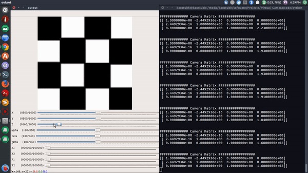
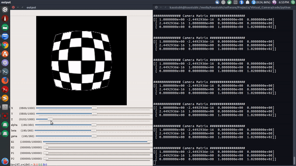
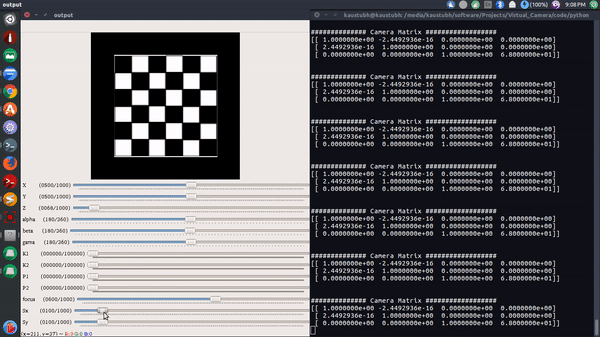

<p align="Left">
  
</p>

# VirtualCam

Virtual camera is created **only using OpenCV and numpy**. It simulates a camera where **we can control** all its parameters **intrinsic and extrinsic** to get a better understanding how each component in the **camera projection matrix** affects the final image of the object captured by the camera. It can be used to understand concepts of image formation and to understand the intrinsic and extrinsic camera parameters. An interractive GUI is also provided which simulates a virtual camera and a plane in 3D world. By changing the extrinsic parameters of the camera (rotation and translation) you can simulate how the image being formed changes.

Standard books related to multi-view geometry and computer vision were refered to ensure validty of equations in the code.
I also refered this [blog from learnopencv.com](https://www.learnopencv.com/geometry-of-image-formation/) to understand the geometry of image formation.

#### An interesting application of this library can be seen in [FunMirrors project](https://github.com/kaustubh-sadekar/FunMirrors/blob/master/README.md)

[Link to the post about FunMirrors](https://www.learnopencv.com/funny-mirrors-using-opencv/)

## Instructions to run the GUI

1. Install the virtual camera library using the following command
```shell
pip3 install vcam
```
2. Clone the repositoy
`git clone https://github.com/kaustubh-sadekar/VirtualCam.git`
3. Run the GUI using the following command
`python3 GUI.py`

### Camera Translation


When you control the X, Y, Z trackerbars you are basically controlling the position of camera in the 3D world. The plane remains fixed and thus we can observe shifting of the plane as we move the camera. You can also objserve the changes in the last column of the camera projection matrix being prined in the right terminal.


### Camera Rotation


When you control the alpha, beta, gamma trackbars you are controlling the rotations of camera in 3D world. This gives turning effect to the image.

### Camera Distortion Coefficients


When you control the k and p trackbars you are controlling the distortion coefficients. The computations performed in numpy also take into account the equation for lens distortions for a pin hole camera.

### Camera apparent pixel size and focal lenght


When you control the sx and sy trackbars the apparent pixel size in x and y direction changes. As Sx increases the apparent pixel width increases making the image stretch horizontally and similarly Sy increases the apparent pixel height, making the image stretch vertically. 

Basically the plane is a mesh of 3D points. We compute the camera projection matrix and thus the image coordinates corresponding to these 3D points. The projected points and the original mesh points are used to compute a map and finally a remapping function is applied on the image.

`python3 GUI.py`

## Code files
`GUI.py` is the file for GUI to play with camera parameters.
